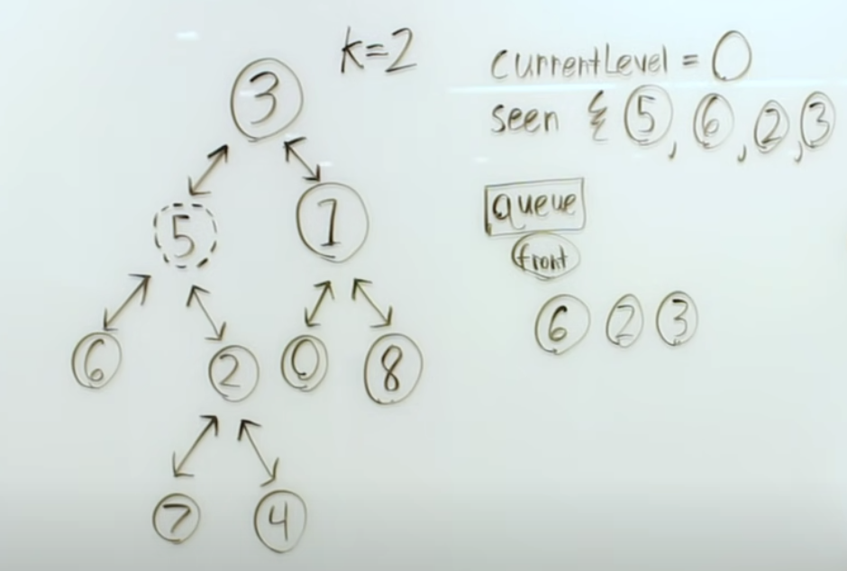

# Solution

我們將 Binary Tree 除了 left and right 外，
另外在增加 `Parent` 的方向，這樣我們就可以知道所有節點到目標節點的距離

1. 使用 DFS 增加每個節點的父節點資訊
2. 使用 BFS 從目標節點開始做 Level Order Traversal
3. 當 Level == 目標部數時，就返回 Queue 中的所有值

## Reference:
- [All Nodes Distance K In A Binary Tree - Performing Bidirectional Search On A Tree Using A Hashtable](https://www.youtube.com/watch?v=nPtARJ2cYrg)

