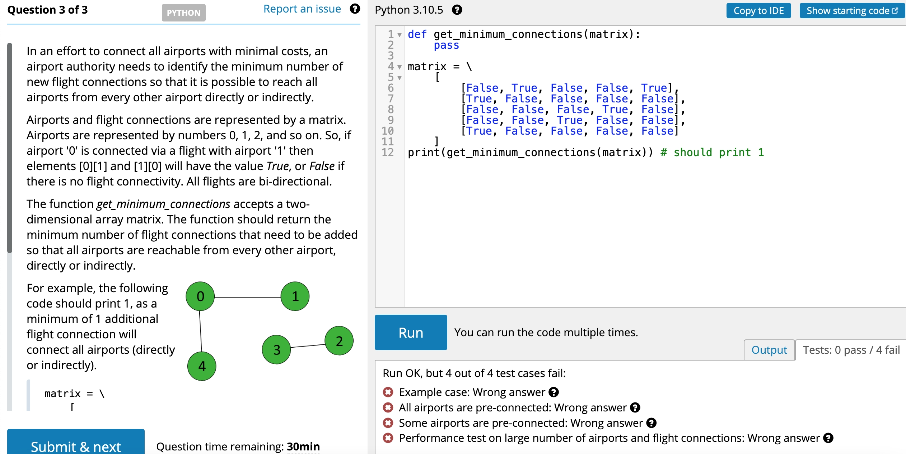

# Get Minimum Connections



## Solution

```python
def get_minimum_connections(matrix):
    graph = collections.defaultdict(list)
    for i in range(len(matrix)):
        for j in range(len(matrix[0])):
            if matrix[i][j] == True:
                graph[i].append(j)

    # BFS
    nums_of_part = 0
    queue = [] # start
    visited = [False] * len(graph)
    while not all(visited):
        queue = [visited.index(False)]
        while queue:
            curr_node = queue.pop()
            for neighbour in graph[curr_node]:
                if visited[neighbour] == False:
                    visited[neighbour] = True
                    queue.append(neighbour)
        nums_of_part += 1

    return nums_of_part-1
```
